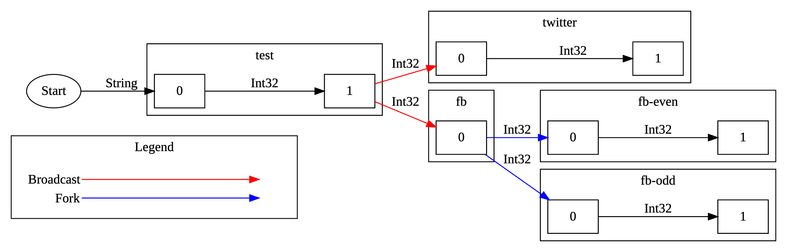

# dataflow-builder

TPL Dataflow is a nice library to build pipeline to process data in memory. The downside is that
it's cumbersome to construct a pipeline that is readable and consistent. This library aims to
reduce the friction of constructing the pipeline by providing methods that is type safe and
intuitive for consumers to use.

# Usage
A simple usage can be like this:
```cs
var pipelineBlockOpts = new PipelineBlockOptions<ExecutionDataflowBlockOptions>
{
  BlockOptions = new() { MaxDegreeOfParallelism = 1 },
  LinkOptions = new() { PropagateCompletion = true }
};

// <string> is the type that the pipeline accepts
var pipeline = new Pipeline<string>("test-pipeline");
pipeline
  .AddFirstBlock(int.Parse) // Convert string to int
  .AddBlock(number => number * 2, pipelineBlockOpts) // Double each int
  .AddBlock(number => number.ToString(), pipelineBlockOpts) // Convert int back to string
  .AddManyBlock(str => str.ToArray(), pipelineBlockOpts) // Convert string to char array & each char is sent to next block
  .AddLastBlock(character => Console.WriteLine($"OUTPUT: {character}"), pipelineBlockOpts); // Print to console

var runner = pipeline.Build();
await runner.ExecuteAsync(["10", "20"]);
```

## Async
For async operation, use `AddAsyncBlock()`. You can mix both async and sync operation to
build the pipeline. But you can only have either sync or async **first** block AND either sync
or async **last** block.
```cs
var pipelineBlockOpts = new PipelineBlockOptions<ExecutionDataflowBlockOptions>
{
  BlockOptions = new() { MaxDegreeOfParallelism = 1 },
  LinkOptions = new() { PropagateCompletion = true }
};

// <string> is the type that the pipeline accepts
var pipeline = new Pipeline<string>("test-pipeline");
pipeline
  .AddFirstBlock(int.Parse)
  .AddBlock(number => number * 2, pipelineBlockOpts)
  .AddAsyncBlock(async number =>
  {
    await Task.Delay(1000);
    return number.ToString();
  }, pipelineBlockOpts)
  .AddLastAsyncBlock(async str =>
  {
    await Task.Delay(1000);
    Console.WriteLine($"OUTPUT: {str}");
  }, pipelineBlockOpts);

var runner = pipeline.Build();
await runner.ExecuteAsync(["1", "2"]);
```

Normally if you have a pipeline like this:
```
(string -> Task<int>) => (Task<int> -> void)
```
where the output type of the first block is the type of the next block. However, it can
be not as "fluent" when building this pipeline with `Task`. So this library includes the
`AddAsyncBlock` that "unwraps" the task for you, and allows the type inside the `Task` to
be carried to the next block. For example, the above example now become:
```
(string -> Task<int>) => (int -> void)
```

But if you do need to return a `Task` and the next block does need to accept a `Task`, then
you can use `AddBlock` with the parameter `allowTaskOutput=true`.

## Fork
This library supports "branching" off a pipeline into multiple pipelines by callling `Fork()`:
```cs
var pipelineBlockOpts = new PipelineBlockOptions<ExecutionDataflowBlockOptions>
{
  BlockOptions = new() { MaxDegreeOfParallelism = 1 },
  LinkOptions = new() { PropagateCompletion = true }
};

var evenPipeline = new Pipeline<int>("even");
evenPipeline
  .AddFirstBlock(number => number)
  .AddLastBlock(number => Console.WriteLine($"EVEN: {number}"), pipelineBlockOpts);

var oddPipeline = new Pipeline<int>("odd");
oddPipeline
  .AddFirstBlock(number => number)
  .AddLastBlock(number => Console.WriteLine($"ODD: {number}"), pipelineBlockOpts);

var pipeline = new Pipeline<string>("test");
pipeline
  .AddFirstBlock(int.Parse)
  .Fork()
    // If it's even number, deliver the number to evenPipeline
    .Branch(number => number % 2 == 0, evenPipeline, pipelineBlockOpts.LinkOptions)
    // For other value, deliver to oddPipeline
    .Default(oddPipeline, pipelineBlockOpts.LinkOptions);

var runner = pipeline.Builder();
await runner.ExecuteAsync(["1", "2", "3"]);
```

## Broadcast
This library supports "broadcasting" which is delivering the same value to multiple branch pipelines by callling `Broadcast()`:
```cs
var pipelineBlockOpts = new PipelineBlockOptions<ExecutionDataflowBlockOptions>
{
  BlockOptions = new() { MaxDegreeOfParallelism = 1 },
  LinkOptions = new() { PropagateCompletion = true }
};

var broadcastBlockOpts = new PipelineBlockOptions<DataflowBlockOptions>
{
  BlockOptions = new() { MaxDegreeOfParallelism = 1 },
  LinkOptions = new() { PropagateCompletion = true }
};

var fbPipeline = new Pipeline<int>("fb");
fbPipeline
  .AddFirstBlock(number => number)
  .AddLastBlock(number => Console.WriteLine($"FB: {number}"), pipelineBlockOpts);

var twitterPipeline = new Pipeline<int>("twitter");
twitterPipeline
  .AddFirstBlock(number => number)
  .AddLastBlock(number => Console.WriteLine($"TWITTER: {number}"), pipelineBlockOpts);

var pipeline = new Pipeline<string>("test");
pipeline
  .AddFirstBlock(int.Parse)
  .Broadcast(null, broadcastBlockOpts)
    // For every .Branch(), the same value will be deliver to every branch pipeline
    .Branch(fbPipeline, pipelineBlockOpts.LinkOptions)
    .Branch(twitterPipeline, pipelineBlockOpts.LinkOptions);

var runner = pipeline.Builder();
await runner.ExecuteAsync(["1", "2", "3"]);
```

## Export for Visualization
To visualize your pipeline, use the method `pipeline.ExportAsync(<PipelineExporter>)`. You can define your own
exporter and pass it to the method `ExportAsync`. This libary ships with `GraphvizExporter` to make it easy
for you to get started.
```cs
var pipelineBlockOpts = new PipelineBlockOptions
{
  BlockOptions = new() { MaxDegreeOfParallelism = 1 },
  LinkOptions = new() { PropagateCompletion = true }
};

var fbEvenPipeline = new Pipeline<int>("fb-even");
fbEvenPipeline
  .AddFirstBlock(number => number)
  .AddLastBlock(number => Console.WriteLine($"fb-even: {number}"), pipelineBlockOpts);

var fbOddPipeline = new Pipeline<int>("fb-odd");
fbOddPipeline
  .AddFirstBlock(number => number)
  .AddLastBlock(number => Console.WriteLine($"fb-odd: {number}"), pipelineBlockOpts);

var fbPipeline = new Pipeline<int>("fb");
fbPipeline
  .AddFirstBlock(number => number)
  .Fork()
    .Branch(number => number % 2 == 0, fbEvenPipeline, pipelineBlockOpts.LinkOptions)
    .Default(fbOddPipeline, pipelineBlockOpts.LinkOptions);

var twitterPipeline = new Pipeline<int>("twitter");
twitterPipeline
  .AddFirstBlock(number => number)
  .AddLastBlock(number => Console.WriteLine($"TWITTER: {number}"), pipelineBlockOpts);

var pipeline = new Pipeline<string>("test");
pipeline
  .AddFirstBlock(int.Parse)
  .Broadcast(null, pipelineBlockOpts)
    .Branch(fbPipeline, pipelineBlockOpts.LinkOptions)
    .Branch(twitterPipeline, pipelineBlockOpts.LinkOptions);

// Copy the output and visualize it in https://magjac.com/graphviz-visual-editor/
System.Console.WriteLine(await pipeline.ExportAsync(new GraphvizExporter()));
```

This is the visualize of the pipeline above.

